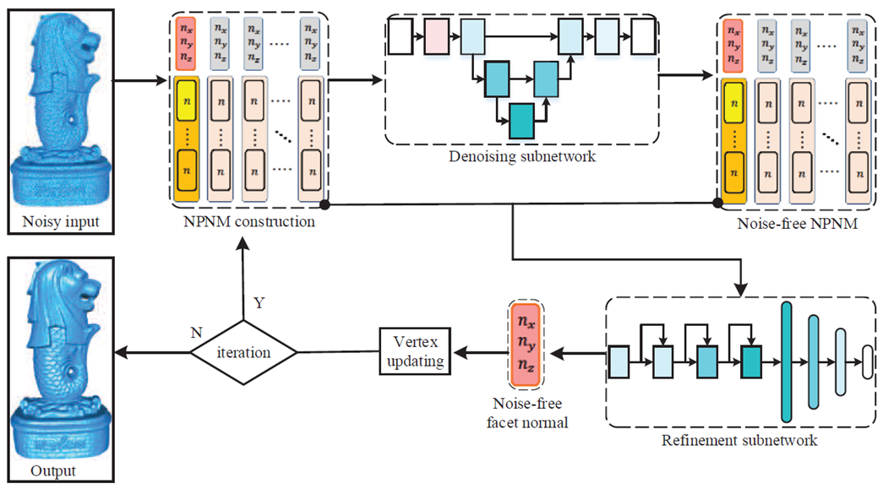
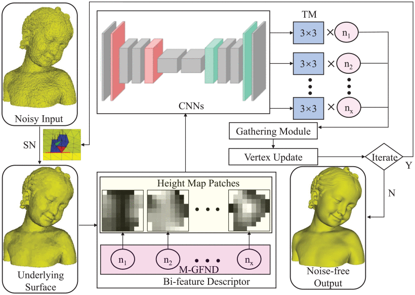

I am currently a Ph.D. student with [National Center for Computer Animation](https://www.bournemouth.ac.uk/about/our-faculties/faculty-media-communication/national-centre-computer-animation), Bournemouth University, supervised by  Dr. Xiaosong Yang and co-supervised by Professor JianJun Zhang. 

I received the B.E. degree from Nanjing University of Aeronautics and Astronautics. 
My research interests include: (1) **3D Computer Vision**: 3D scene understanding, 3D scene flow estimation. (2) **Computer Graphics**: mesh denoising, geometry processing.

_______________________________________________________________________________________________________
<h3>
   Selected Publications
</h3>

 
            <table cellspacing="0" cellpadding="0" class="noBorder">
                <tbody>
	          <tr>
                    <td class="noBorder" width="40%">
                        
                            </td>
                    <td>
	                    <b>NormalF-Net: Normal filtering neural network for feature-preserving mesh denoising</b>
	                     
	                    <strong>Zhiqi Li</strong>,Yingkui Zhang, Yidan Feng, Xingyu Xie, Qiong Wang, Mingqiang Wei, Pheng-Ann Heng. 
	                     
	                    <em>Computer-Aided Design (2020) </em>
	                     
			    [<a href="https://doi.org/10.1016/j.cad.2020.102861">Paper</a>]
                    </td>
                </tr>
	          <tr>
                    <td width="40%">
                        
                            </td>
                    <td>
	                    <b>Cascaded Normal Filtering Neural Network for Geometry-aware Mesh Denoising of Measurement Surfaces</b>
	                     
	                    Dingkun Zhu, Yingkui Zhang, <strong>Zhiqi Li</strong>, Weiming Wang, Haoran Xie, Mingqiang Wei, Gary Cheng, Fu Lee Wang.
	                     
	                    <em>IEEE Transactions on Instrumentation and Measurement, 2021 </em>
	                     
			 [<a href="https://ieeexplore.ieee.org/document/9360624">Paper</a>]
                    </td>
                </tr>
            	</tbody>
            </table>

_______________________________________________________________________________________________________

<h3>
   Academic Experience
</h3>

      <ul>
         <li>Undergraduate intern, A*STAR, Singapore, August 2019 - October 2019.</li>
      </ul>

      <ul>
         <li>Participant in challenge <strong>Odin Vision</strong>, Data study group,<a href="https://www.turing.ac.uk/events/data-study-group-april-2021"> Alan Turing Institute</a>, UK, April 2021.</li>
      </ul>

      <ul>
         <li>Participant in challenge <strong>OSNI</strong>, Turing-LIDA DSG 2021,<a href="https://lida.leeds.ac.uk/partnerships/lida-partners/the-alan-turing-institute/turing-data-study-group-at-lida/call-for-researcher-participants/"> Alan Turing Institute</a>, UK, July 2021.</li>
      </ul>

      <ul>
         <li>Excited to attend the Eastern European Machine Learning Summer School in Vilnius, Lithuania 🇱🇹,<a href="https://www.eeml.eu"> EEML 2022</a>, July 2022.</li>
      </ul>

<ul>
         <li>Excited to receive the Enrichment Placement Award. I will join the Alan Turing PhD Enrichment Scheme in January 2023 ,<a href="https://www.turing.ac.uk/work-turing/studentships/enrichment"> Alan Turing Enrichment 2022-2023</a>, Oct 2022.</li>
      </ul>

